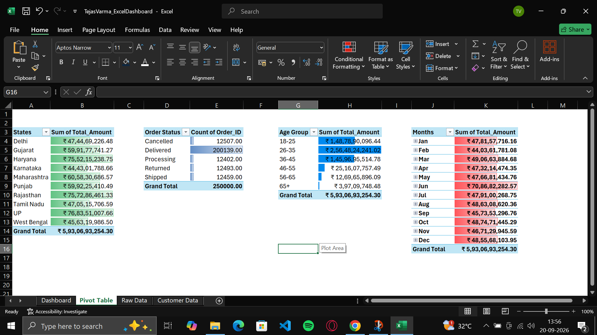
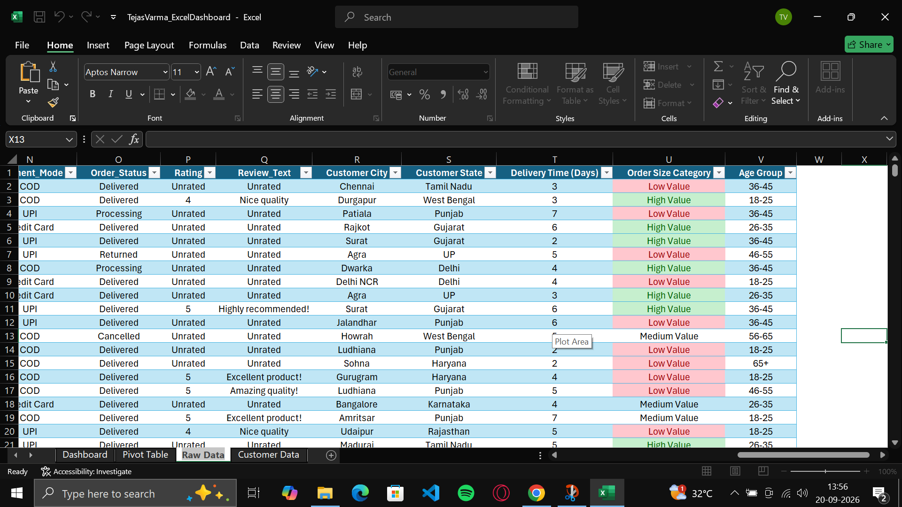
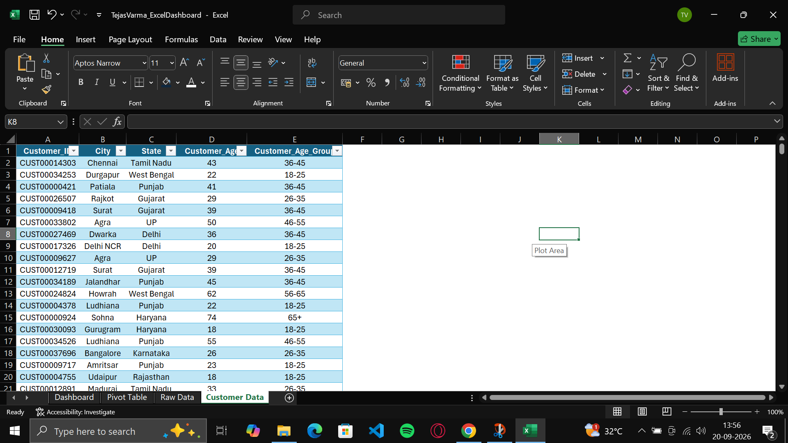

<div align="center">

# -- ! E-Commerce Performance & Fulfillment Analytics — Excel Dashboard Project ! --
### *A 250,000-Order Excel Workbook for Lookups, PivotTables, Slicers & a Live Executive Dashboard*

[](https://www.microsoft.com/en-us/microsoft-365/excel)
[](https://support.microsoft.com/excel)
[](https://support.microsoft.com/excel)
[](https://support.microsoft.com/excel)
[](https://support.microsoft.com/excel)

<br/>

> *"250,000 orders — one dashboard that shows where the revenue comes from and how well it gets delivered."*

</div>

---

## 📋 Table of Contents

- [📌 Overview](#-overview)
- [🎯 Problem Statement](#-problem-statement)
- [✨ Key Features](#-key-features)
- [🏗️ Project Structure](#️-project-structure)
- [🔄 Project Workflow](#-project-workflow)
- [🧱 Workbook Design — `TejasVarma_ExcelDashboard.xlsx`](#-workbook-design--tejasvarma_exceldashboardxlsx)
- [🖥️ Sheet-by-Sheet Screenshots](#️-sheet-by-sheet-screenshots)
- [🛠️ Tech Stack](#️-tech-stack)
- [📈 Results & Insights](#-results--insights)
- [🏆 Advantages](#-advantages)
- [📄 License](#-license)
- [👤 Author](#-author)
- [🙏 Acknowledgements](#-acknowledgements)

---

## 📌 Overview

**E-Commerce Performance & Fulfillment Analytics** is a self-contained Excel workbook that models **250,000 online orders** placed between **June 2024 and June 2026** across ten Indian states. Four linked sheets turn a raw order log and a customer master into calculated business columns, a set of PivotTables, and a live executive Dashboard with slicers, a timeline, and KPI cards.

This project is designed to:
- Practice **lookup formulas** (`VLOOKUP`, `INDEX`/`MATCH`) to enrich orders with each customer's city, state, and age group
- Build **calculated table columns** for delivery time and order-size categories using `IF` logic
- Summarize revenue with **PivotTables** sliced by State, Age Group, Order Status, and Month
- Apply **conditional formatting** (data bars and gradients) to make pivot outputs readable at a glance
- Add **interactive filtering** with Payment Mode and Order Size slicers plus an Order Date timeline
- Tie every sheet together into a single **dark-themed Dashboard** with four charts, three KPI cards, and written insights

---

## 🎯 Problem Statement

> **Objective:** Build a multi-sheet Excel workbook (`TejasVarma_ExcelDashboard.xlsx`) that ingests a 250,000-row e-commerce order log and a customer master, enriches each order with customer attributes, and delivers a single-page interactive Dashboard that answers *where revenue comes from* and *how healthy fulfillment is*.

| 📂 Feature | 📄 Type | 🔍 Description |
|------------|---------|----------------|
| Order Log | Core | 250,000 rows × 22 columns — order, product, pricing, coupon, payment, status, rating, and delivery details |
| Customer Master | Core | Customer ID, City, State, Age, and Age Group used to enrich every order |
| Calculated Columns | Core | City, State, and Age Group lookups plus Delivery Time (Days) and Order Size Category |
| State / Age / Month Pivots | Core | Revenue (`Sum of Total_Amount`) by State, Age Group, and Month |
| Order Status Pivot | Core | `Count of Order_ID` by Cancelled, Delivered, Processing, Returned, Shipped |
| Slicers & Timeline | Structure | Payment Mode and Order Size Category slicers with an Order Date timeline |
| Executive Dashboard | Structure | KPI cards, four charts, and a written insights panel in one view |

The goal is to demonstrate **end-to-end Excel analytics** — from raw transactional data to enriched columns to an executive-ready dashboard — entirely without macros.

---

## ✨ Key Features

| Feature | Description |
|--------|-------------|
| 🗄️ **Four Linked Sheets** | `Dashboard`, `Pivot Table`, `Raw Data`, and `Customer Data` |
| 🔗 **Lookup-Enriched Orders** | `Customer City`, `Customer State`, and `Age Group` are pulled from `Customer Data` with `VLOOKUP` and `INDEX`/`MATCH` |
| 🚚 **Delivery Time Column** | `Delivery_Date − Order_Date` in days, with a `Not Delivered` fallback when no delivery date exists |
| 🏷️ **Order Size Category** | Orders above ₹20,000 are **High Value**, above ₹5,000 are **Medium Value**, everything else is **Low Value** |
| 🧮 **Four PivotTables** | Revenue by State, Order Status count, Revenue by Age Group, and Revenue by Month — all on one shared pivot cache |
| 🎨 **Conditional Formatting** | Green data bars on States, blue bars on Order Status and Age Group, red gradient bars on Months |
| 🎚️ **Slicers & Timeline** | `Payment_Mode` and `Order Size Category` slicers plus an `Order_Date` timeline filter every chart at once |
| 📊 **Four Charts** | 3D column (Revenue by State), 3D pie (Order Status Breakdown), 3D bar (Revenue by Age Group), and line (Monthly Revenue Trend) |
| 💳 **KPI Cards** | Total Revenue, Total Orders, and Average Order Value (AOV) linked to the Pivot Table sheet |

---

## 🏗️ Project Structure

```
📦 ecommerce-excel-dashboard/
│
├── 📊 TejasVarma_ExcelDashboard.xlsx   ← Full workbook: 4 sheets, pivots + slicers + dashboard
│
├── 🖼️ Screenshots/                      ← Sheet-by-sheet reference images
│   ├── Dashboard.png
│   ├── PivotTable.png
│   ├── PivotTable_Formatted.png
│   ├── RawData.png
│   └── CustomerData.png
│
└── 📄 README.md                         ← Project documentation
```

---

## 🔄 Project Workflow

```
Start
  │
  ▼
┌───────────────────────────┐
│  Customer Data sheet        │  Customer_ID → City, State, Age, Age Group
└─────────────┬─────────────┘
              │
              ▼
┌───────────────────────────┐
│  Raw Data sheet             │  250,000 orders → Quantity, Pricing, Coupon, Payment, Status, Rating
└─────────────┬─────────────┘
              │
              ▼
┌───────────────────────────┐
│  Calculated Columns         │  VLOOKUP / INDEX-MATCH → City, State, Age Group
│                             │  IF logic → Delivery Time, Order Size Category
└─────────────┬─────────────┘
              │
              ▼
┌───────────────────────────┐
│  Pivot Table sheet          │  States · Order Status · Age Group · Months
└─────────────┬─────────────┘
              │
              ▼
┌─────────────────────────────────────────────────────────────┐
│   DASHBOARD → Slicers + Timeline + KPI cards + 4 charts        │
│   → Reads live from the Pivot Table sheet                     │
└─────────────────────────────┬───────────────────────────────┘
                               │
                               ▼
                     Executive Insights Panel
        (peak revenue, core demographic, top states, fulfillment health)
                               │
                               ▼
                             Done ✅
```

---

## 🧱 Workbook Design — `TejasVarma_ExcelDashboard.xlsx`

The workbook contains four sheets, with the Dashboard reading live from the Pivot Table sheet:

| Sheet | Key Columns | Purpose |
|-------|-------------|---------|
| 🖥️ **Dashboard** | — | KPI cards, Payment Mode / Order Size slicers, Order Date timeline, four charts, and written executive insights |
| 🧮 **Pivot Table** | `States`, `Order Status`, `Age Group`, `Months` | Four PivotTables feeding every dashboard chart, with data-bar conditional formatting |
| 🧾 **Raw Data** | `Order_ID`, `Customer_ID`, `Product_ID`, `Order_Date`, `Order_Time`, `Delivery_Date`, `Quantity`, `Unit_Price`, `Order_Value`, `Shipping_Cost`, `Coupon_Code`, `Coupon_Discount`, `Total_Amount`, `Payment_Mode`, `Order_Status`, `Rating`, `Review_Text`, `Customer City`, `Customer State`, `Delivery Time (Days)`, `Order Size Category`, `Age Group` | The master 250,000-row order log every other sheet pulls from |
| 👥 **Customer Data** | `Customer_ID`, `City`, `State`, `Customer_Age`, `Customer_Age_Group` | Customer master used to enrich each order via lookups |

| Concept | Where it's used |
|---------|-----------------|
| 🔍 **`VLOOKUP`** | Pulls `Customer City` and `Age Group` from `Customer Data` by `Customer_ID` |
| 🔎 **`INDEX`/`MATCH`** | Pulls `Customer State` from `Customer Data` by `Customer_ID` |
| 🚚 **Delivery Formula** | `IF(ISBLANK(Delivery_Date), "Not Delivered", Delivery_Date − Order_Date)` |
| 🏷️ **Nested `IF`** | `>20,000` → High Value, `>5,000` → Medium Value, otherwise Low Value |
| 🧮 **PivotTables** | Revenue by State / Age Group / Month and order counts by Status |
| 🎚️ **Slicers & Timeline** | Payment Mode and Order Size Category slicers with an Order Date timeline |
| 🎨 **Conditional Formatting** | Data bars and gradient fills on every pivot's value column |
| 📊 **Charts** | 3D column, 3D pie, 3D bar, and line charts driven by the pivots |

---

## 🖥️ Sheet-by-Sheet Screenshots

**Dashboard** — the full executive view with slicers, KPIs, charts, and insights:


**Pivot Table** — the four PivotTables (States, Order Status, Age Group, Months) before formatting:



**Pivot Table (Formatted)** — the same pivots with data-bar conditional formatting applied:


**Raw Data** — the 250,000-row order log with the calculated columns on the right:



**Customer Data** — the customer master used for the lookups:



---

## 🛠️ Tech Stack

| Tool | Version | Purpose |
|------|---------|---------|
| 📗 **Microsoft Excel** | 365 / 2021+ | Spreadsheet engine used to build and run the workbook |
| 🧮 **PivotTables** | Built-in | Revenue and order-count summaries by State, Age Group, Status, and Month |
| 🎚️ **Slicers & Timeline** | Built-in (Excel 2013+) | Interactive filtering by Payment Mode, Order Size, and Order Date |
| 🔍 **Lookup Functions** | Built-in | `VLOOKUP` and `INDEX`/`MATCH` for customer enrichment |
| 🧠 **Logical Functions** | Built-in | `IF` and `ISBLANK` for delivery time and order-size categories |
| 📈 **Charts** | Built-in | 3D column, 3D pie, 3D bar, and line charts |
| 🎨 **Conditional Formatting** | Built-in | Data bars and color gradients on pivot values |

---

## 📈 Results & Insights

Reading the Dashboard and Pivot Table sheets produces:

- 💵 **₹5,93,06,93,254.30** (≈ ₹593.07 Cr) total revenue across **250,000 orders**, with an **Average Order Value of ₹23,722.77**
- ✅ **80% of orders are delivered** — 200,139 out of 250,000 — while Cancelled (12,507), Returned (12,493), Processing (12,402), and Shipped (12,459) each hold roughly 5%
- 📦 **Delivered orders bring in ₹474.16 Cr**, about 80% of total revenue
- 🎯 **The 26–35 age group is the core demographic** at **₹256.5 Cr (over 43% of revenue)**, followed by **18–25 at ₹148.8 Cr** and **36–45 at ₹146.0 Cr** — a strong case for targeting millennials and young adults
- 🌍 **Uttar Pradesh leads all states** at **₹76.8 Cr**, with **Rajasthan (₹75.7 Cr)** and **Haryana (₹75.5 Cr)** close behind — a strong brand presence across northern and north-western India
- 📅 **Revenue is steady month to month** at roughly **₹22–25 Cr per calendar month**; June's ₹70.9 Cr pivot total stands out because the data covers **three Junes (2024, 2025, 2026)** versus two of every other month
- 💳 **UPI is the most-used payment mode** at **128,474 orders (51%)**, followed by **COD (82,093)**, **Debit Card (28,856)**, and **Credit Card (10,577)**
- 🚚 **Average delivery time is about 4.5 days** across all orders
- 🎟️ **80% of orders (199,815) use no coupon**, while `SAVE10` leads the coupon codes at **24,997 orders**
- ⭐ **Every submitted rating is 3 stars or higher** — 59,997 five-star and 47,976 four-star ratings against 12,057 three-star ratings

---

## 🏆 Advantages

| Advantage | Detail |
|-----------|--------|
| 🔗 **Formula-Driven Enrichment** | City, State, Age Group, Delivery Time, and Order Size update automatically from the source columns |
| 🧮 **One Pivot Cache, Four Views** | All four PivotTables share a single cache, so refreshing once updates every chart |
| 🎚️ **Interactive Filtering** | Payment Mode and Order Size slicers plus the Order Date timeline reshape the dashboard instantly |
| 📊 **Business Reporting in One File** | KPI cards, charts, and written insights sit together on a single executive page |
| 🚀 **Built for Scale** | Handles a 250,000-row order log and a 250,000-row customer master in a single workbook |
| 🧪 **Extensible** | Easy to extend with new pivots (e.g. `Coupon_Code`, `Product_ID`) or extra dashboard KPIs |

---

## 📄 License

This project is licensed under the **MIT License** — see the [LICENSE](LICENSE) file for full details.

```
MIT License — Free to use, modify, and distribute with attribution.
```

---

## 👤 Author

<div align="center">

### Tejas Varma

[](https://github.com/Tejas14302)

> *"Every dashboard starts with a well-designed formula — just like every program starts with a single line."*

**🎓 Role:** Excel Analyst | Programming Enthusiast \
**📍 Location:** Surat, India \
**🛠️ Skills:** Excel · PivotTables · Slicers & Timelines · Lookup Formulas · Dashboard Design

</div>

---

## 🙏 Acknowledgements

Special thanks to the following resources and communities that made this project possible:

- 📚 [Microsoft Excel Function Reference](https://support.microsoft.com/en-us/office/excel-functions-alphabetical-b3944572-255d-4efb-bb96-c6d90033e188) — Official function documentation
- 🧮 [Excel PivotTables Overview](https://support.microsoft.com/en-us/office/create-a-pivottable-to-analyze-worksheet-data-a9a84538-bfe9-40a9-a8e9-f99134456576) — Reference for PivotTables and Slicers
- 🔍 [Excel Lookup & Reference Functions](https://support.microsoft.com/en-us/office/lookup-and-reference-functions-reference-841e8c17-19b3-4536-9cba-9a222247e1b1) — Reference for `VLOOKUP` and `INDEX`/`MATCH`
- 💬 [Stack Overflow Community](https://stackoverflow.com/) — Problem-solving support

---

<div align="center">

---

*Made with ❤️ and PivotTables — Last updated: 20 September, 2026*

</div>
