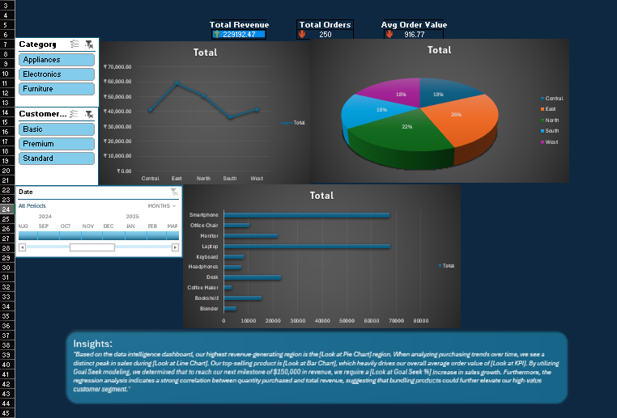
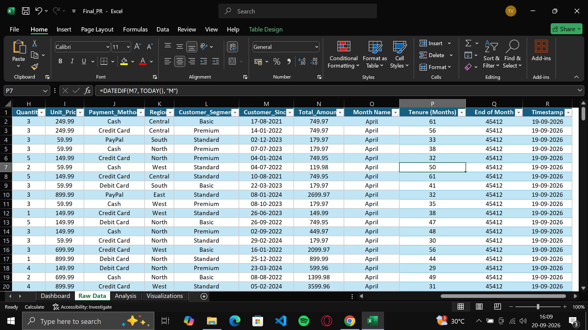
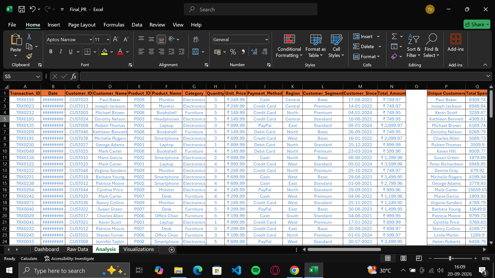
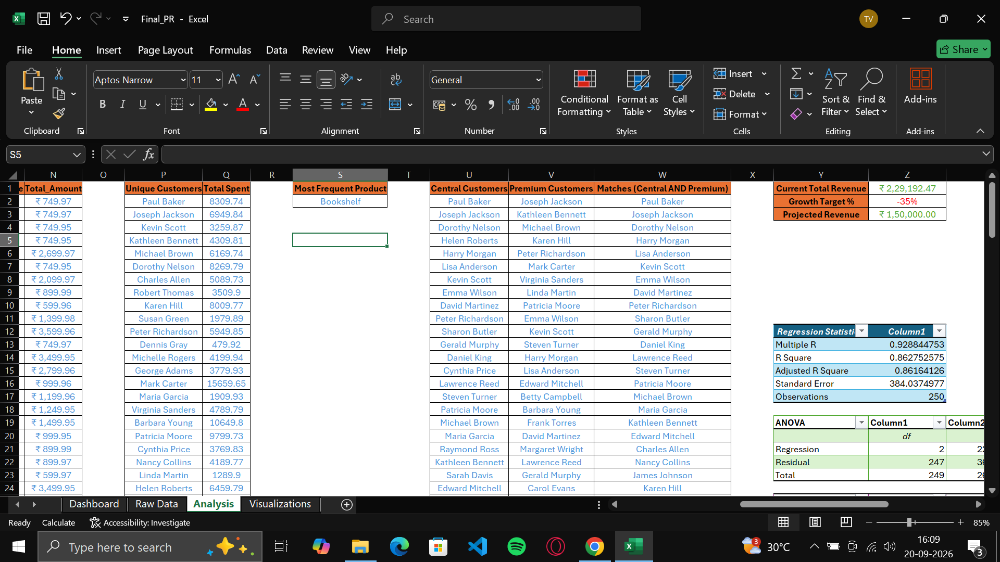
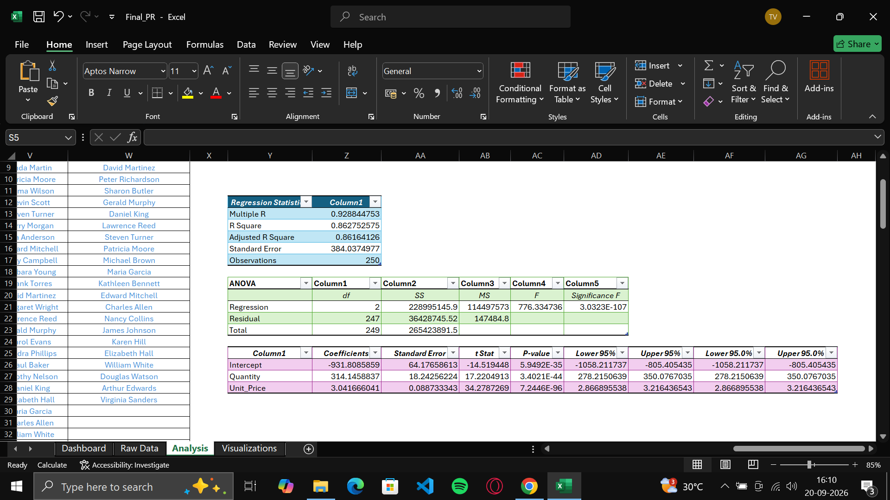
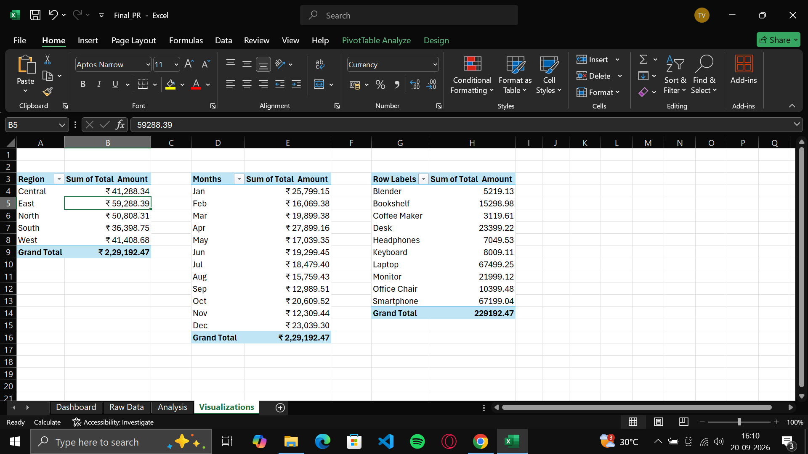

<div align="center">

# -- ! Retail Sales Intelligence — Excel Dashboard Project ! --
### *A Multi-Sheet Excel Workbook for Dynamic Arrays, Goal Seek, Regression, Pivoting & a Live Dashboard*

[](https://www.microsoft.com/en-us/microsoft-365/excel)
[](https://support.microsoft.com/excel)
[](https://support.microsoft.com/excel)
[](https://support.microsoft.com/excel)
[](https://support.microsoft.com/excel)

<br/>

> *"250 transactions — one dashboard that shows which region, product, and customer segment drive the revenue."*

</div>

---

## 📋 Table of Contents

- [📌 Overview](#-overview)
- [🎯 Problem Statement](#-problem-statement)
- [✨ Key Features](#-key-features)
- [🏗️ Project Structure](#️-project-structure)
- [🔄 Project Workflow](#-project-workflow)
- [🧱 Workbook Design — `Final_PR.xlsx`](#-workbook-design--final_prxlsx)
- [🖥️ Sheet-by-Sheet Screenshots](#️-sheet-by-sheet-screenshots)
- [🛠️ Tech Stack](#️-tech-stack)
- [📈 Results & Insights](#-results--insights)
- [🏆 Advantages](#-advantages)
- [📄 License](#-license)
- [👤 Author](#-author)
- [🙏 Acknowledgements](#-acknowledgements)

---

## 📌 Overview

**Retail Sales Intelligence** is a self-contained Excel workbook that models **250 sales transactions** placed by **50 customers** between **April 2024 and April 2025**, covering ten products (laptops, smartphones, desks, monitors, and more) in three categories — Electronics, Furniture, and Appliances — across five regions. Four linked sheets turn the raw transaction log into dynamic-array analysis, a Goal Seek revenue model, a multiple regression, three PivotTables, and a live executive Dashboard.

This project is designed to:
- Practice **dynamic array functions** (`FILTER`, `UNIQUE`, `ANCHORARRAY`) to build live, self-updating lists
- Rank customers by lifetime spend with **`UNIQUE` + `SUMIFS`** and surface the most frequent product with `INDEX`/`MODE`/`MATCH`
- Cross-reference customer groups (**Central AND Premium**) with `FILTER` and `COUNTIF`
- Run a **Goal Seek** what-if model to find the growth percentage needed to hit a revenue target
- Build a **multiple linear regression** to test how Quantity and Unit Price predict Total Amount
- Summarize revenue with **PivotTables** by Region, Month, and Product
- Tie every sheet together into a single **interactive Dashboard** with slicers, a timeline, KPI cards, and charts

---

## 🎯 Problem Statement

> **Objective:** Build a multi-sheet Excel workbook (`Final_PR.xlsx`) that ingests a 250-row sales transaction log, then derives filtered views, customer rankings, a Goal Seek model, a regression model, and pivot summaries — culminating in a single-page interactive Dashboard.

| 📂 Feature | 📄 Type | 🔍 Description |
|------------|---------|----------------|
| Transaction Log | Core | 250 rows × 18 columns — customer, product, category, quantity, price, payment, region, segment, and total amount |
| Calculated Columns | Core | Month Name, Customer Tenure (Months), End of Month, and a persistent Timestamp |
| Dynamic Array Analysis | Core | High-value transactions, unique customers, spend per customer, and segment/region overlaps |
| Goal Seek Model | Core | Growth % needed to move current revenue to a projected target |
| Regression Model | Core | Total Amount modeled on Quantity and Unit Price via the Data Analysis ToolPak |
| Region / Month / Product Pivots | Structure | Three PivotTables on the `Visualizations` sheet feeding the dashboard charts |
| Executive Dashboard | Structure | Slicers, timeline, KPI cards, line/pie/bar charts, and a written insights panel |

The goal is to demonstrate **end-to-end Excel analytics** — from raw transactional data to dynamic-array analysis to statistical modeling to an executive-ready dashboard — entirely without macros.

---

## ✨ Key Features

| Feature | Description |
|--------|-------------|
| 🗄️ **Four Linked Sheets** | `Dashboard`, `Raw Data`, `Analysis`, and `Visualizations` |
| 🔎 **High-Value Transaction Filter** | `FILTER` spills every transaction above ₹500 — **124 of 250** — into a live table |
| 👥 **Unique Customer Ranking** | `UNIQUE` lists the 50 customers and `SUMIFS` with `ANCHORARRAY` totals each customer's spend |
| 🛒 **Most Frequent Product** | `INDEX`/`MODE`/`MATCH` identifies the product that appears in the most transactions |
| 🤝 **Segment Overlap Lists** | Central customers (32), Premium customers (41), and the **28 customers who are both** |
| 🎯 **Goal Seek Model** | Current Total Revenue, Growth Target %, and Projected Revenue solved to exactly ₹1,50,000 |
| 📈 **Regression Output** | R² of 0.86 with Quantity and Unit Price both highly significant |
| 🧮 **Three PivotTables** | Sum of `Total_Amount` by Region, Month, and Product |
| 🎚️ **Slicers & Timeline** | `Category` and `Customer_Segment` slicers with a `Date` timeline filter every chart |
| 💳 **KPI Cards** | Total Revenue, Total Orders, and Average Order Value with data bars and arrow icon sets |
| 🕒 **Persistent Timestamp** | `NOW()` stamps each transaction once and holds it using iterative calculation |

---

## 🏗️ Project Structure

```
📦 retail-sales-excel-dashboard/
│
├── 📊 Final_PR.xlsx                    ← Full workbook: 4 sheets, formulas + pivots + dashboard
│
├── 🖼️ Screenshots/                      ← Sheet-by-sheet reference images
│   ├── Dashboard.png
│   ├── RawData.png
│   ├── Analysis_Filters.png
│   ├── Analysis_GoalSeek.png
│   ├── Analysis_Regression.png
│   └── Visualizations.png
│
└── 📄 README.md                        ← Project documentation
```

---

## 🔄 Project Workflow

```
Start
  │
  ▼
┌───────────────────────────┐
│  Raw Data sheet             │  250 transactions → Quantity, Unit Price, Region, Segment, Total Amount
│                             │  + Month Name, Tenure (Months), End of Month, Timestamp
└─────────────┬─────────────┘
              │
              ▼
┌───────────────────────────┐
│  Analysis sheet             │  FILTER / UNIQUE / SUMIFS → High-value orders, customer spend
│                             │  Goal Seek → Growth target  |  Regression → R² = 0.863
└─────────────┬─────────────┘
              │
              ▼
┌───────────────────────────┐
│  Visualizations sheet       │  Region · Month · Product PivotTables
└─────────────┬─────────────┘
              │
              ▼
┌─────────────────────────────────────────────────────────────┐
│   DASHBOARD → Slicers + Timeline + KPI cards + Line/Pie/Bar    │
│   → Reads live from the Raw Data and Visualizations sheets    │
└─────────────────────────────┬───────────────────────────────┘
                               │
                               ▼
                     Executive Insights Panel
        (top region, sales trend, top product, goal seek, regression)
                               │
                               ▼
                             Done ✅
```

---

## 🧱 Workbook Design — `Final_PR.xlsx`

The workbook contains four sheets, with the Dashboard reading live from the others:

| Sheet | Key Columns | Purpose |
|-------|-------------|---------|
| 🖥️ **Dashboard** | — | KPI cards, Category / Customer Segment slicers, Date timeline, three charts, and written executive insights |
| 🧾 **Raw Data** | `Transaction_ID`, `Date`, `Customer_ID`, `Customer_Name`, `Product_ID`, `Product_Name`, `Category`, `Quantity`, `Unit_Price`, `Payment_Method`, `Region`, `Customer_Segment`, `Customer_Since`, `Total_Amount`, `Month Name`, `Tenure (Months)`, `End of Month`, `Timestamp` | The master 250-row transaction log every other sheet pulls from |
| 📊 **Analysis** | `Unique Customers`, `Total Spent`, `Most Frequent Product`, `Central Customers`, `Premium Customers`, `Matches (Central AND Premium)`, `Current Total Revenue`, `Growth Target %`, `Projected Revenue`, Regression Statistics, ANOVA, Coefficients | Dynamic-array lists, the Goal Seek model, and the regression output |
| 🧮 **Visualizations** | `Region`, `Months`, `Row Labels` (Product) | Three PivotTables of `Sum of Total_Amount` that feed the dashboard charts |

| Concept | Where it's used |
|---------|-----------------|
| 🔎 **`FILTER`** | Spills all transactions with `Total_Amount > 500` on the Analysis sheet |
| 👥 **`UNIQUE` + `SUMIFS`** | Lists each customer once and totals their spend via `ANCHORARRAY` |
| 🛒 **`INDEX`/`MODE`/`MATCH`** | Finds the most frequently purchased product |
| 🤝 **`FILTER` + `COUNTIF`** | Returns customers who appear in both the Central and Premium lists |
| 🎯 **Goal Seek** | `Projected Revenue = Current Total Revenue × (1 + Growth Target %)`, solved for the target |
| 📈 **Regression (ToolPak)** | `Total_Amount` predicted from `Quantity` and `Unit_Price` — R², ANOVA, coefficients |
| 📅 **`TEXT` / `EOMONTH`** | `Month Name` (`"mmmm"`) and `End of Month` derived from each transaction date |
| ⏳ **`DATEDIF` + `TODAY()`** | `Tenure (Months)` since `Customer_Since` |
| 🕒 **`NOW()` + iterative calc** | Timestamp that records when each row was first entered and then holds its value |
| 🧮 **PivotTables + Slicers + Timeline** | Region, Month, and Product summaries filtered by Category, Segment, and Date |

---

## 🖥️ Sheet-by-Sheet Screenshots

**Dashboard** — the full executive view with slicers, KPIs, charts, and insights:



**Raw Data** — the 250-row transaction log with the calculated columns on the right:



**Analysis (Dynamic Arrays)** — high-value transactions, unique customers with total spend, the most frequent product, and the Central / Premium overlap lists:



**Analysis (Goal Seek)** — current revenue, growth target %, and projected revenue, alongside the regression statistics:



**Analysis (Regression)** — Total Amount modeled on Quantity and Unit Price, R² = 0.863:



**Visualizations** — Region, Month, and Product PivotTables feeding the dashboard:



---

## 🛠️ Tech Stack

| Tool | Version | Purpose |
|------|---------|---------|
| 📗 **Microsoft Excel** | 365 | Spreadsheet engine used to build and run the workbook (dynamic arrays require 365 / 2021+) |
| 🔎 **Dynamic Array Functions** | Built-in | `FILTER`, `UNIQUE`, and `ANCHORARRAY` for live spill ranges |
| 📊 **Aggregate & Lookup Functions** | Built-in | `SUMIFS`, `COUNTIF`, `MODE`, `INDEX`/`MATCH` for spend totals and top-product lookup |
| 📅 **Date Functions** | Built-in | `TEXT`, `EOMONTH`, `DATEDIF`, `TODAY`, and `NOW` for month names, tenure, and timestamps |
| 🎯 **Goal Seek** | Built-in | What-if analysis to solve for the revenue growth target |
| 📈 **Data Analysis ToolPak** | Add-in | Multiple linear regression output |
| 🧮 **PivotTables, Slicers & Timeline** | Built-in | Interactive Region / Month / Product summaries |
| 📈 **Charts** | Built-in | Line chart, 3D pie chart, and bar chart |
| 🎨 **Conditional Formatting** | Built-in | Data bars and arrow icon sets on the KPI cards |

---

## 📈 Results & Insights

Reading the Dashboard and feeder sheets produces:

- 💵 **₹2,29,192.47** total revenue across **250 orders**, with an **Average Order Value of ₹916.77** and **753 units** sold
- 🌍 **East is the top-performing region** at **₹59,288.39 (26% of revenue)**, followed by **North (₹50,808.31, 22%)**, while **South is the smallest** at ₹36,398.75 (16%)
- 💻 **Laptop leads all products** at **₹67,499.25**, with **Smartphone** just behind at **₹67,199.04** — together about **59% of total revenue**
- 🛒 **Bookshelf is the most frequently purchased product**, appearing in **35 transactions**, even though its revenue (₹15,298.98) is much lower than the top two
- 🔌 **Electronics generates 75% of revenue** (₹1,71,756.05), against Furniture at ₹49,097.68 (21%) and Appliances at ₹8,338.74 (4%)
- 👑 **Premium customers are the highest-value segment** at **₹84,657.12 (37%)**, narrowly ahead of Standard at ₹82,357.54
- 🏆 **Mark Carter is the top customer** with **₹15,659.65** in total spend, followed by Edward Mitchell (₹11,919.77) and Barbara Young (₹10,649.80)
- 📅 **January 2025 is the strongest full calendar month** at **₹25,799.15**, followed by December 2024 at ₹23,039.30 (the pivot's April total of ₹27,899.16 combines two partial spans — 11–30 April 2024 and 1–11 April 2025)
- 🔎 **124 of 250 transactions exceed ₹500**, and **28 customers belong to both the Central region and the Premium segment**
- 🎯 **Goal Seek solves the growth target at −34.55%**, moving revenue from ₹2,29,192.47 to a projected **₹1,50,000.00**
- 📈 **Regression confirms Quantity and Unit Price strongly predict Total Amount** — R² of **0.863**, F-statistic of **776.33**, Significance F of **3.03E-107**, with coefficients of **314.15** (Quantity) and **3.04** (Unit Price)

---

## 🏆 Advantages

| Advantage | Detail |
|-----------|--------|
| 🔗 **Fully Formula-Driven** | Every list, ranking, and KPI recalculates live from the Raw Data sheet — only the Goal Seek result is a stored value |
| 🔎 **Self-Updating Lists** | Dynamic arrays resize automatically as transactions are added or removed |
| 🎯 **Built-In Scenario Testing** | The Goal Seek block shows the growth needed to reach any revenue target |
| 📊 **Statistics + Business Reporting in One File** | Combines ToolPak-grade regression with a business-facing dashboard |
| 🧮 **Interactive Filtering** | Category and Segment slicers plus the Date timeline reshape the dashboard instantly |
| 🧪 **Extensible** | Easy to extend with more pivots (e.g. `Payment_Method`, `Customer_Segment`) or additional dashboard KPIs |

---

## 📄 License

This project is licensed under the **MIT License** — see the [LICENSE](LICENSE) file for full details.

```
MIT License — Free to use, modify, and distribute with attribution.
```

---

## 👤 Author

<div align="center">

### Tejas Varma

[](https://github.com/Tejas14302)

> *"Every dashboard starts with a well-designed formula — just like every program starts with a single line."*

**🎓 Role:** Excel Analyst | Programming Enthusiast \
**📍 Location:** Surat, India \
**🛠️ Skills:** Excel · Dynamic Arrays · Goal Seek · Regression · PivotTables · Dashboard Design

</div>

---

## 🙏 Acknowledgements

Special thanks to the following resources and communities that made this project possible:

- 📚 [Microsoft Excel Function Reference](https://support.microsoft.com/en-us/office/excel-functions-alphabetical-b3944572-255d-4efb-bb96-c6d90033e188) — Official function documentation
- 📊 [Excel Data Analysis ToolPak](https://support.microsoft.com/en-us/office/use-the-analysis-toolpak-to-perform-complex-data-analysis-6c67ccf0-f4a9-487c-8dec-bdb5a2cefab6) — Reference for the Regression tool
- 🧮 [Excel PivotTables Overview](https://support.microsoft.com/en-us/office/create-a-pivottable-to-analyze-worksheet-data-a9a84538-bfe9-40a9-a8e9-f99134456576) — Reference for PivotTables and Slicers
- 🔍 [Excel Lookup & Reference Functions](https://support.microsoft.com/en-us/office/lookup-and-reference-functions-reference-841e8c17-19b3-4536-9cba-9a222247e1b1) — Reference for `INDEX`/`MATCH`
- 💬 [Stack Overflow Community](https://stackoverflow.com/) — Problem-solving support

---

<div align="center">

---

*Made with ❤️ and PivotTables — Last updated: 20 September, 2026*

</div>
